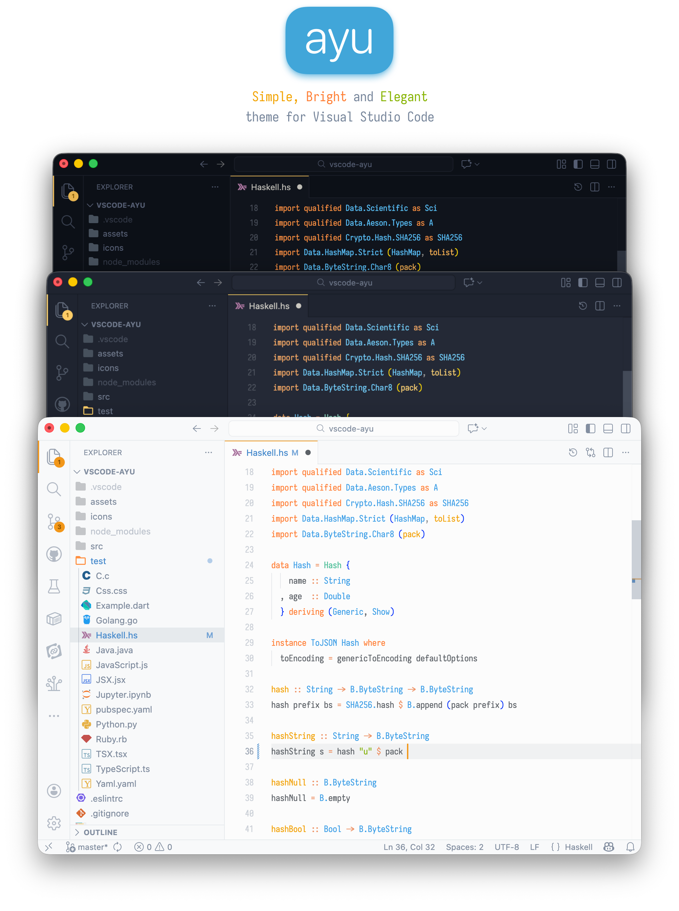
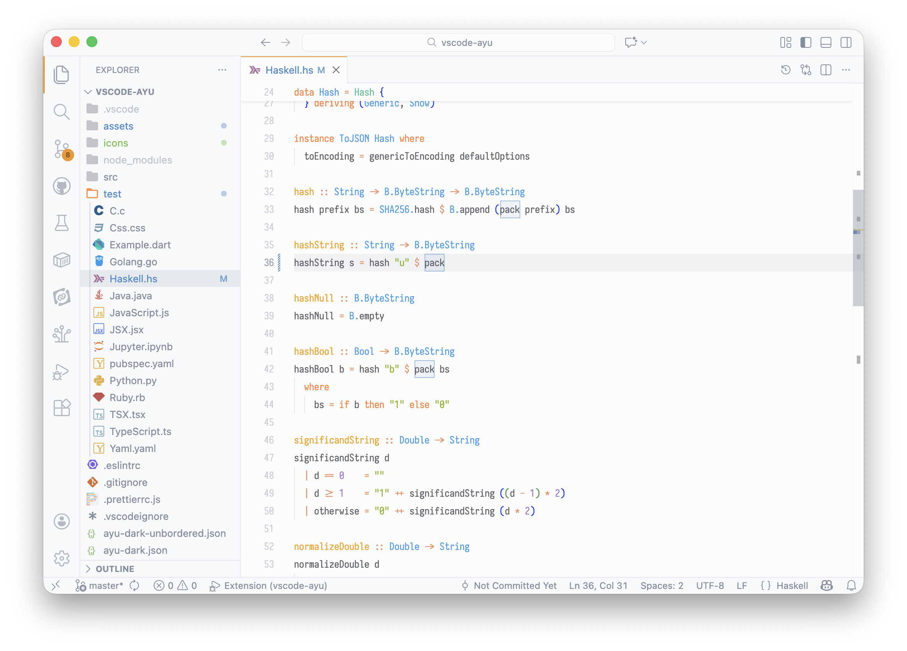
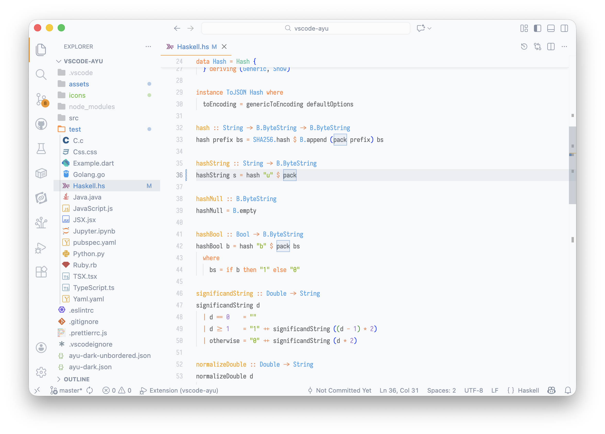
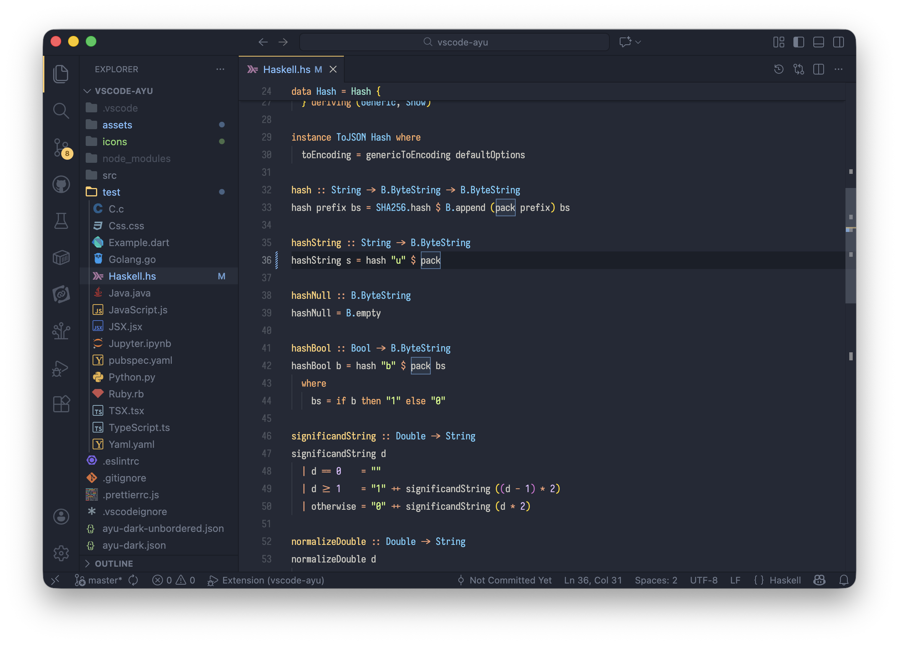
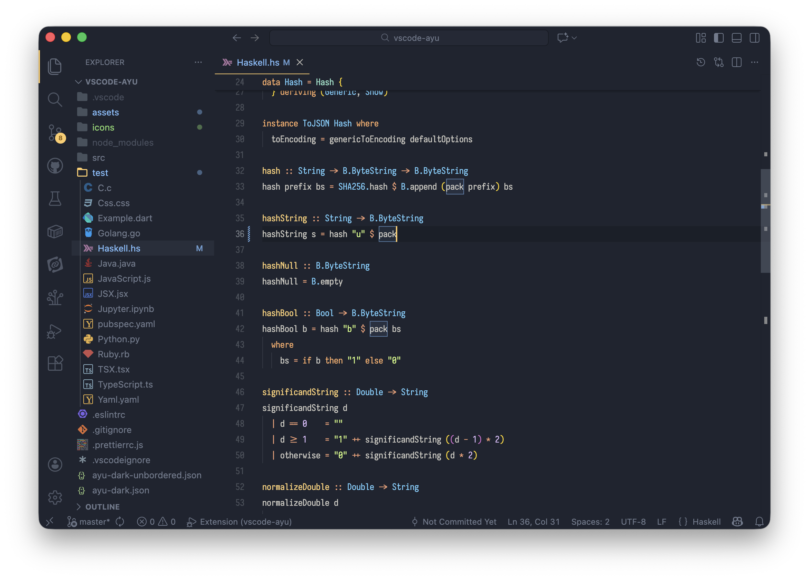
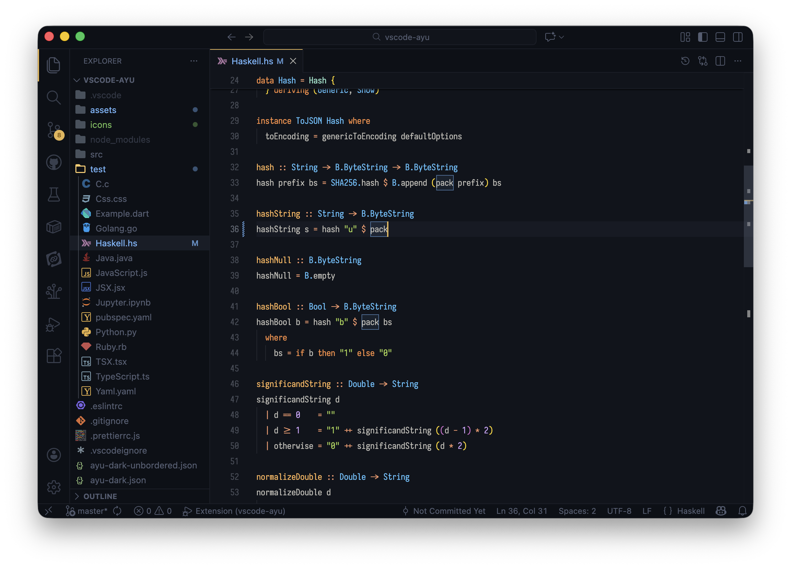
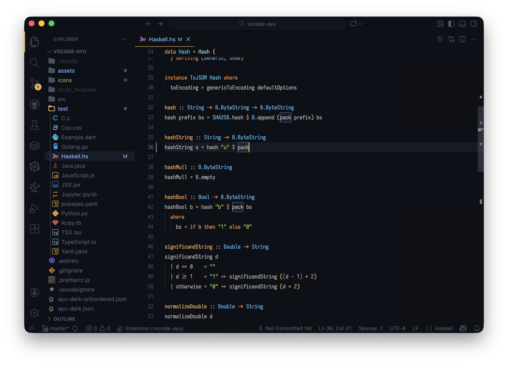

<p align="center">
  
</p>

<p align="center">
  <a href="https://ayutheme.com">Website</a> •
  <a href="#install">Install</a> •
  <a href="#screenshots">Screenshots</a> •
  <a href="#ports">Ports</a>
</p>

<p align="center">
  <a href="https://marketplace.visualstudio.com/items?itemName=teabyii.ayu">
    
  </a>
  <a href="https://marketplace.visualstudio.com/items?itemName=teabyii.ayu">
    
  </a>
</p>

---

**ayu** is a bright color theme and comes in three versions — _dark_, _mirage_, and _light_ — for all-day comfortable work. Handcrafted for Visual Studio Code.

## Install

[Install from the Marketplace](https://marketplace.visualstudio.com/items?itemName=teabyii.ayu), or run:

```shell
ext install teabyii.ayu
```

Then go to `Preferences > Color Theme` and select one of the Ayu variants.

To enable file icons: `Preferences > File Icon Theme > Ayu`.

## Screenshots

### Light




### Mirage




### Dark




## Customization

**Bordered vs Unbordered**: Bordered themes have visible dividers between UI panels. Unbordered themes have a seamless, unified look.

The extension also includes:

- **6 color themes**: Light, Mirage, and Dark — each with bordered and unbordered variants
- **File icons**: Custom icon theme included
- **[Iosevka font](https://github.com/ayu-theme/vscode-ayu/tree/master/fonts)**: Bundled for a consistent look

## Ports

ayu is available for:

- [Sublime Text](https://github.com/dempfi/ayu)
- [and more...](https://ayutheme.com)

---

<p align="center">
  <a href="https://ayutheme.com">ayutheme.com</a> •
  <a href="https://ko-fi.com/dempfi">Buy me a coffee</a>
</p>
